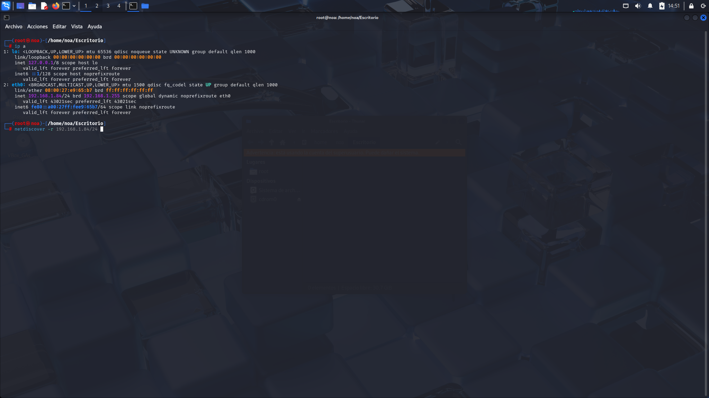
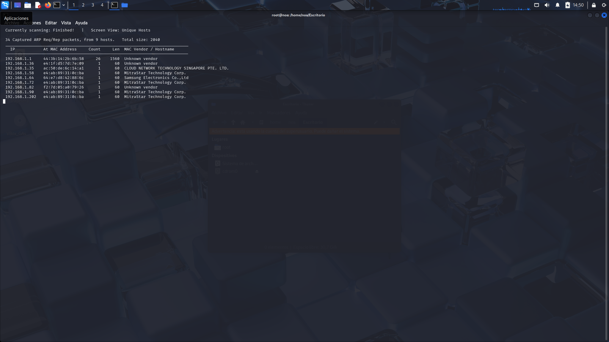
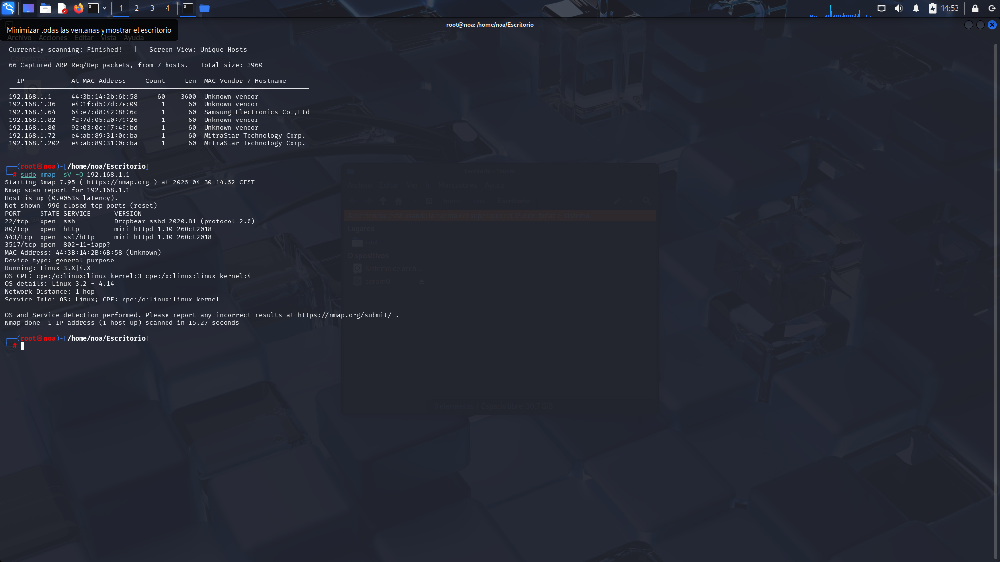

#  Proyecto 1 – Análisis de Red Local con Netdiscover y Nmap

## Objetivo

El objetivo de este proyecto es identificar dispositivos activos en mi red local, descubrir sus direcciones IP y MAC, y analizar los servicios expuestos. Todo el proceso se realiza desde una máquina virtual con Kali Linux y representa el primer paso en una auditoría básica de seguridad de red.

---

## Herramientas utilizadas

- **Kali Linux** (máquina virtual con adaptador puente)
- `ip a` – Para verificar la IP local y la interfaz activa
- `netdiscover` – Para detectar dispositivos activos en la red
- `nmap` – Para escanear puertos, servicios y detectar sistemas operativos

---

## 🧪 Pasos realizados

### 1. Comprobación de la IP local

Comando utilizado:

```bash
ip a
```

Resultado: la interfaz activa era eth0 y la IP asignada 192.168.1.x, lo que confirma que estoy conectada a una red local real con subred 192.168.1.0/24.




### 2. Descubrimiento de dispositivos con Netdiscover

Comando utilizado:

```bash
sudo netdiscover -r 192.168.1.0/24
```



### 3. Escaneo del router (192.168.1.1) con Nmap

Comando utilizado:

```bash
sudo nmap -sV -O 192.168.1.1
```

Resultado:

El router tiene tres puertos abiertos: SSH (22), HTTP (80) y HTTPS (443).

Utiliza el servidor SSH Dropbear y un servidor web ligero (mini_httpd).

El sistema operativo detectado es Linux embebido (Linux 3.2 - 4.14).



### Lecciones aprendidas

Este primer proyecto me ha dado experiencia práctica con técnicas esenciales de reconocimiento de red utilizadas en ciberseguridad. He aprendido a:

Identificar mi propia dirección IP y comprender cómo se estructuran las redes locales.

Usar netdiscover para detectar dispositivos reales conectados a la red local e interpretar direcciones IP, direcciones MAC y fabricantes.

Realizar un escaneo básico con Nmap para detectar puertos abiertos, servicios en ejecución y estimación del sistema operativo.

Leer y analizar los resultados de Nmap, incluyendo cómo identificar servicios (como SSH y HTTP) y sus versiones.

Comprender cómo estas herramientas pueden usarse en las etapas iniciales de una prueba de penetración o auditoría de seguridad.
